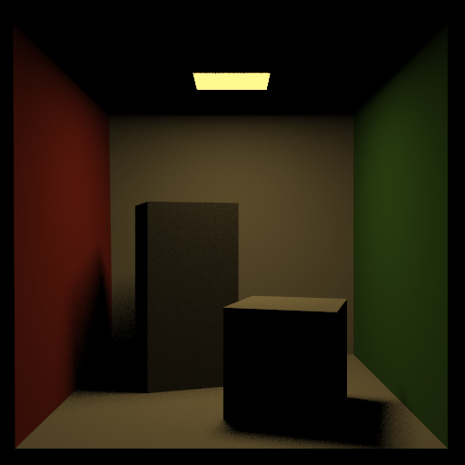
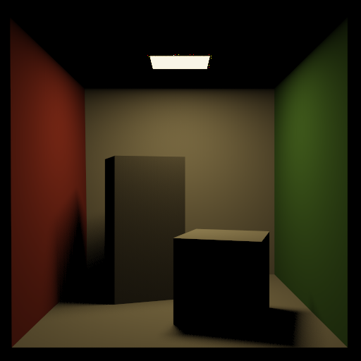
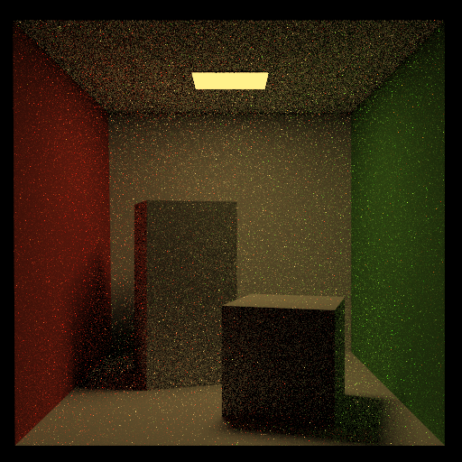
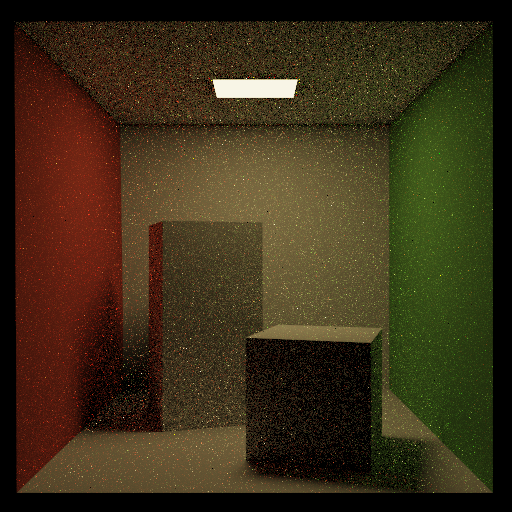
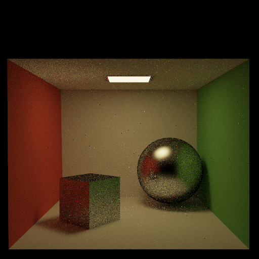

## Path (final submission)

Please fill this out and submit your work to Gradescope by the deadline.

### Output Comparison
Run the program with the specified `.ini` config file to compare your output against the reference images. The program should automatically save to the correct path for the images to appear in the table below.

If you are not using the Qt framework, you may also produce your outputs otherwise so long as you place them in the correct directories as specified in the table. In this case, please also describe how your code can be run to reproduce your outputs

> Qt Creator users: If your program can't find certain files or you aren't seeing your output images appear, make sure to: 
> 1. Set your working directory to the project directory
> 2. Set the command-line argument in Qt Creator to `template_inis/final/<ini_file_name>.ini`

Note that your outputs do **not** need to exactly match the reference outputs. There are several factors that may result in minor differences, such as your choice of tone mapping and randomness.

Please do not attempt to duplicate the given reference images; we have tools to detect this.

| `.ini` File To Produce Output | Expected Output | Your Output |
| :---------------------------------------: | :--------------------------------------------------: | :-------------------------------------------------: |
| cornell_box_full_lighting.ini |   |  |
| cornell_box_direct_lighting_only.ini |   |  |
| cornell_box_full_lighting_low_probability.ini |   |  |
| mirror.ini |   |  |
| glossy.ini |   |  |
| refraction.ini |   |  |

> Note: The reference images above were produced using the [Extended Reinhard](https://64.github.io/tonemapping/#extended-reinhard) tone mapping function with minor gamma correction. You may choose to use another mapping function or omit gamma correction.

### Design Choices
Please list all the features your path tracer implements.

### Extra Features 
Briefly explain your implementation of any extra features, provide output images, and describe what each image demonstrates.
| Extra Features | Without Implementation | My Implementation |
| :---------------------------------------: | :--------------------------------------------------: | :-------------------------------------------------: |
| Attenuate refracted paths |   |  |
| BRDF cosine importance sampling |   |  |
| Low discrepancy sampling |   |  |

I implemented attenuate refracted paths, BRDF cosine importance sampling, and low discrepancy sampling. 
1. For attenuate refracted paths, I selected a absorption coefficient (0.15, 0.15, 0.15), to mimic a grey glass ball. As you can see from the above images, the sphere with attenuate path implemented is slightly darker than the one without. 
2. For BRDF cosine importance sampling, I sample directions from the hemisphere around the surface normal in a way that is proportional to the cosine of the angle between the surface normal and the sampled direction. This is because the Lambertian BRDF is constant and the reflected radiance is proportional to the cosine of the angle between the surface normal and the outgoing direction. As you can see from the above images, the one implemented has slightly less noise and looks overall smoother than the one without. 
3. For the Low discrepancy sampling, I implemented the Quasi Monte Carlo sampling for sampling rays from pixels. QMC samples the space more uniformly than purely random sequences. I use the van der Corput sequence to ensure that the samples are more uniformly distributed over the pixel area. As you can see from the above images, QMC introduces a great anti-aliasing to the image, so that the edges of the box looks a lot smoother, instead of having zig-zag patterns. 

### Collaboration/References
N/A

### Known Bugs
N/A

